# suship shop

<!---#<h2>Overwiew</h2>-->
<!---#<h6><h6>-->

    
<h2>Screenshots</h2>

<table>
  <tr>
    <td></td>
     <td></td>
     <td></td>
  </tr>
  <tr>
<td>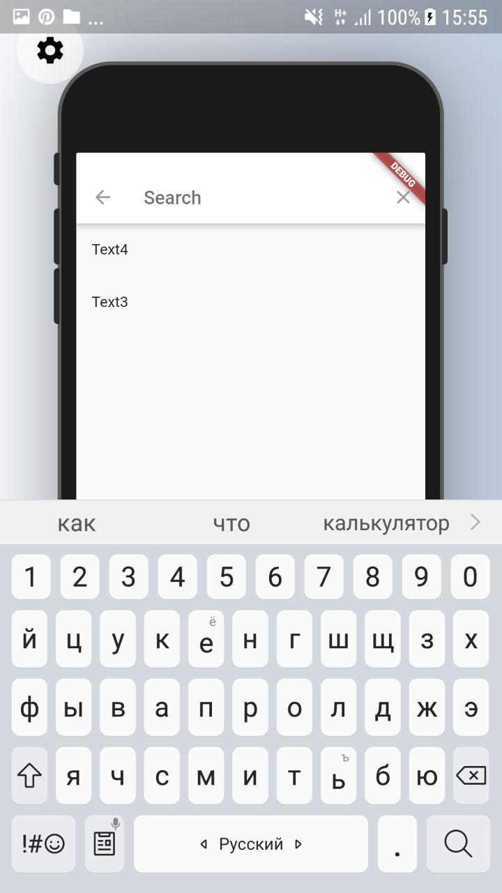</td>
<td>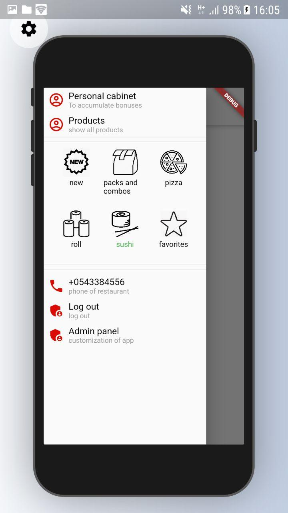</td>
<td>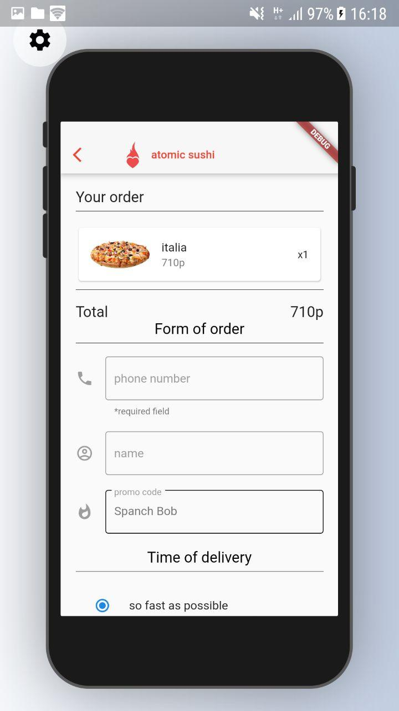</td>
  </tr>
 </table>
 
 <table>
  <tr>
    <td></td>
     <td></td>
     <td></td>
  </tr>
  <tr>
<td>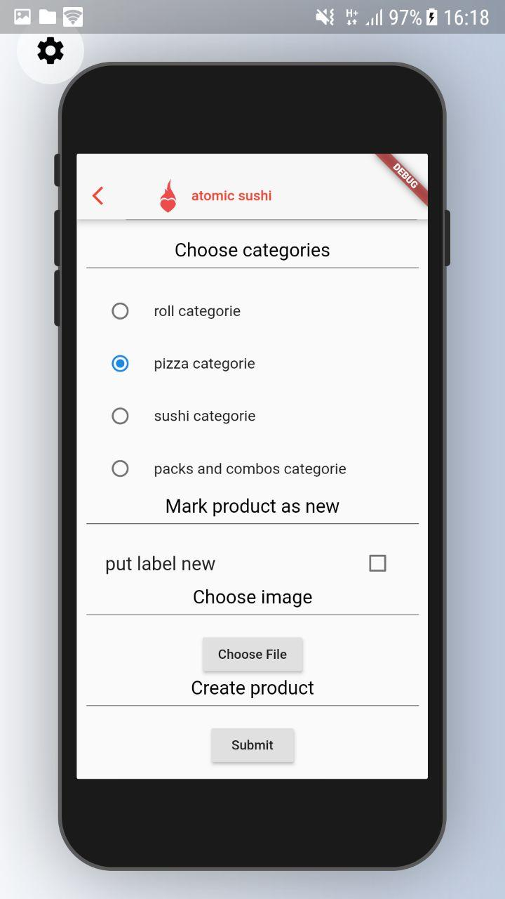</td>
<td>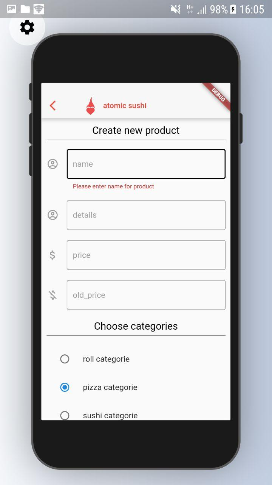</td>
<td>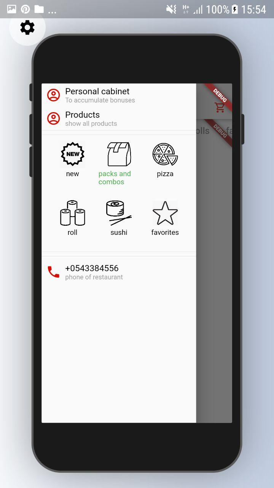</td>
  </tr>
 </table>

<table>
  <tr>
    <td></td>
     <td></td>
     <td></td>
  </tr>
  <tr>
<td>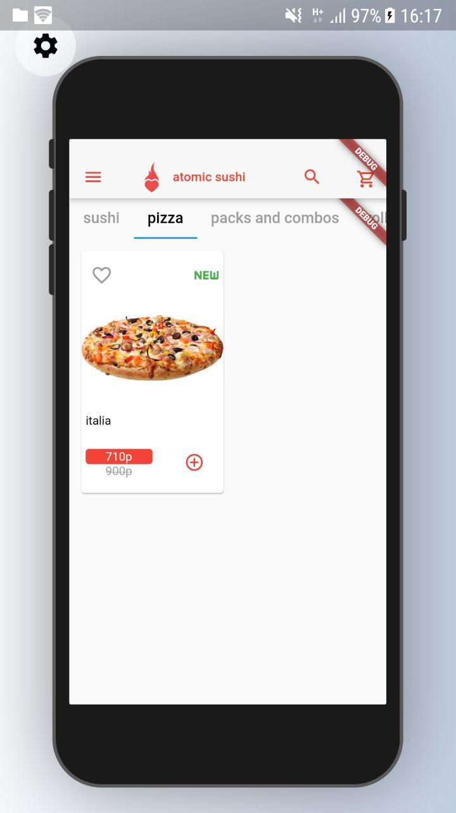</td>
<td>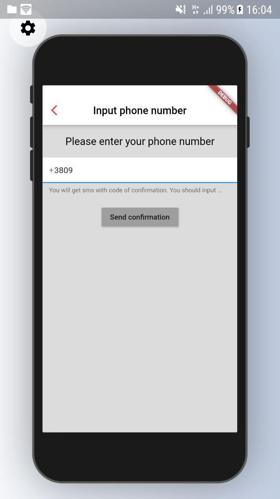</td>
<td>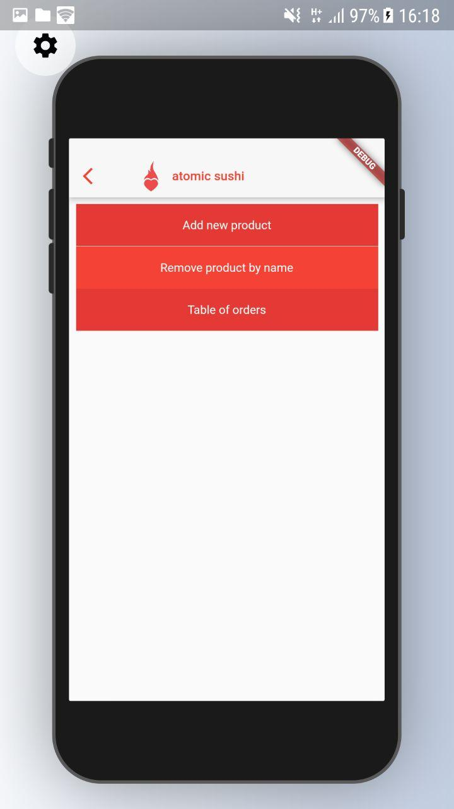</td>
  </tr>
 </table>

<table>
  <tr>
    <td></td>
     <td></td>
     <td></td>
  </tr>
  <tr>
<td>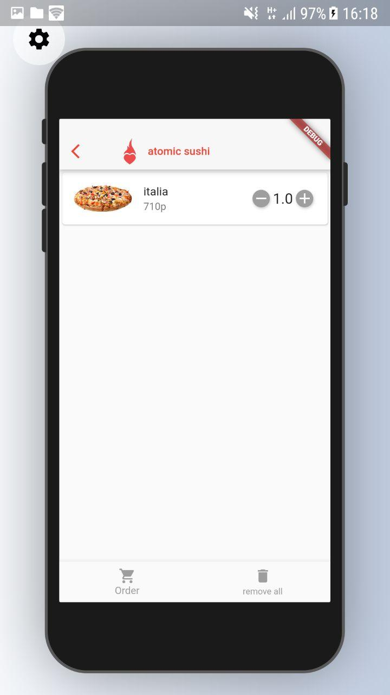</td>
<td>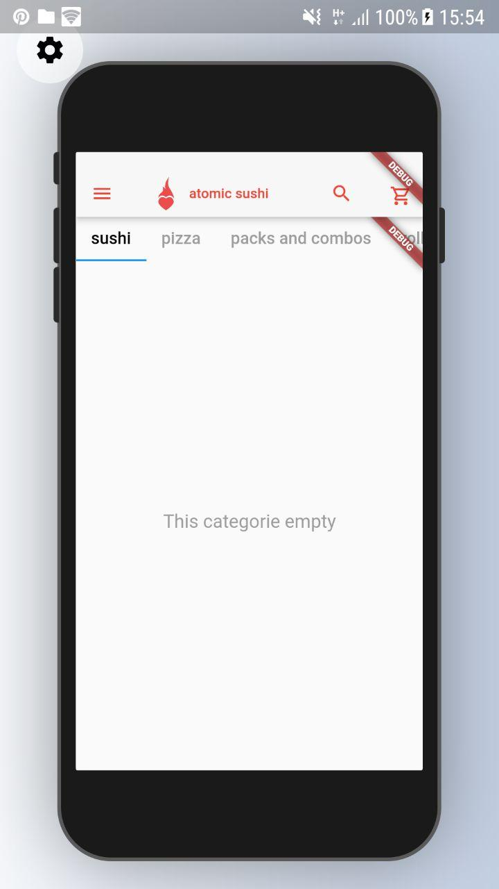</td>
<td></td>
  </tr>
 </table>

<h2>Frameworks and tools</h2>

<h6>
    Flutter&IDE: Flutter Android-Studio 
    Backend: Firebase 
    Frontend: Flutter 
    Linux: Arch Linux 
    Other flutter: loader, http, provider, get_it, grouped_buttons, image_picker, badges, flutter_localization, rounded_data_picker, scoped_models, device_preview  
</h6>

<h2>Tuning project...</h2>

<h6>
    <ol>
        <li>Add firebase: https://firebase.google.com/docs/flutter/setup</li>
   </ol>
</h6>
