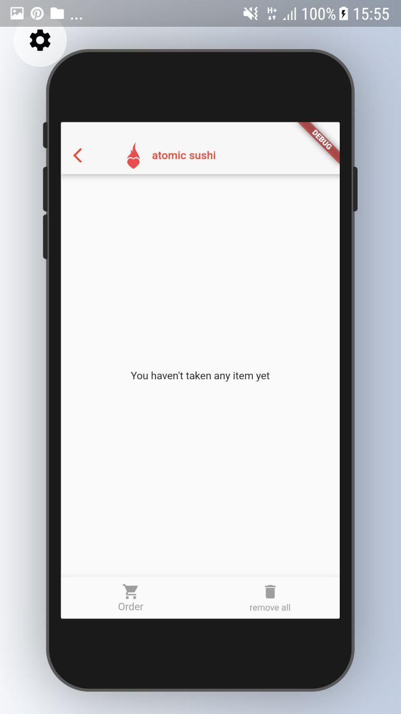

# suship shop

<!---#<h2>Overwiew</h2>-->
<!---#<h6><h6>-->

    
<h2>Screenshots</h2>

<table>
  <tr>
    <td></td>
     <td></td>
     <td></td>
  </tr>
  <tr>
<td></td>
<td></td>
<td></td>
  </tr>
 </table>
 
 <table>
  <tr>
    <td></td>
     <td></td>
     <td></td>
  </tr>
  <tr>
<td></td>
<td></td>
<td></td>
  </tr>
 </table>

<table>
  <tr>
    <td></td>
     <td></td>
     <td></td>
  </tr>
  <tr>
<td></td>
<td></td>
<td></td>
  </tr>
 </table>

<table>
  <tr>
    <td></td>
     <td></td>
     <td></td>
  </tr>
  <tr>
<td></td>
<td></td>
<td></td>
  </tr>
 </table>

<h2>Frameworks and tools</h2>

<h6>
    Flutter&IDE: Flutter Android-Studio 
    Backend: Firebase 
    Frontend: Flutter 
    Linux: Arch Linux 
    Other flutter: loader, http, provider, get_it, grouped_buttons, image_picker, badges, flutter_localization, rounded_data_picker, scoped_models, device_preview  
</h6>

<h2>Tuning project.</h2>

<h6>
    <ol>
        <li>Add firebase: https://firebase.google.com/docs/flutter/setup</li>
   </ol>
</h6>

<h2>Describe</h2>

<h6>

Application is half cooked. Some functional is not implemented, and some bags is not fixed. Testing is not implemented;
Application has next options:
<ol>
<li>Registration/login with phone number</li>    
<li>Products have some categories</li>
<li>Search</li>
<li>Table of orders for admin</li>
<li>CRUD for admin and ordinary user</li>
<li>Mark product as favorite for user</li>
<li>Mark product as new</li>
<li>Separate categorie for new products</li>
<li>Side menu</li>
<li>Loader</li>
<li>Ability to order products for users</li>
</ol>               
</h6>
